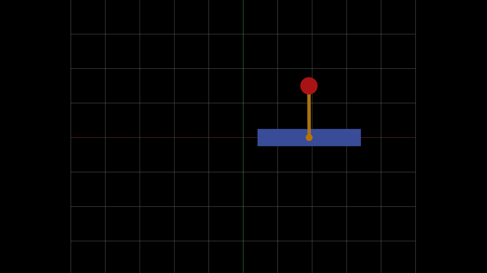
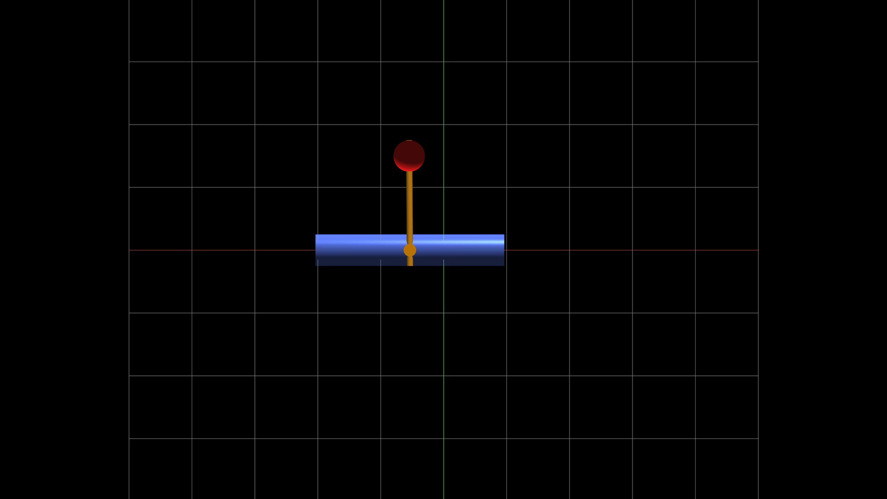

# Inverted pendulum

Control feedback with linearization and neural network for an inverted pendulum (single and on a cart)

## Required Tools

- Git
- CMake
- clang
- curl
- Fortran
- HDF5
- OpenGL
- GLEW
- GLFW
- Dear ImGui
- implot

## Getting Started

To get started with the control feedback:

1. Clone the repository:
   ```
   git clone https://github.com/azimonti/inverted-pendulum
   ```
2. Navigate to the repository directory:
   ```
   cd inverted-pendulum
   ```
3. Initialize and update the submodules:
  ```
  git submodule update --init --recursive
  ```

Further update of the submodule can be done with the command:
  ```
  git submodule update --remote
  ```

4. Compile the binaries and the libraries
  ```
  ./build_libs.sh
  ```

  If any error or missing dependencies please look at the instructions [here](https://github.com/azimonti/ma-libs)

5. Run the programs
  ```
  ./externals/ma-libs/build/Release/pendulum_cart
  ./externals/ma-libs/build/Release/pendulum
  ```

## Screenshot 2 dimensional




## Screenshot 3 dimensional




## License

This project is licensed under the MIT License - see the [LICENSE](LICENSE) file for details.

## Contact

If you have any questions or want to get in touch regarding the project, please open an issue or contact the repository maintainers directly through GitHub.
